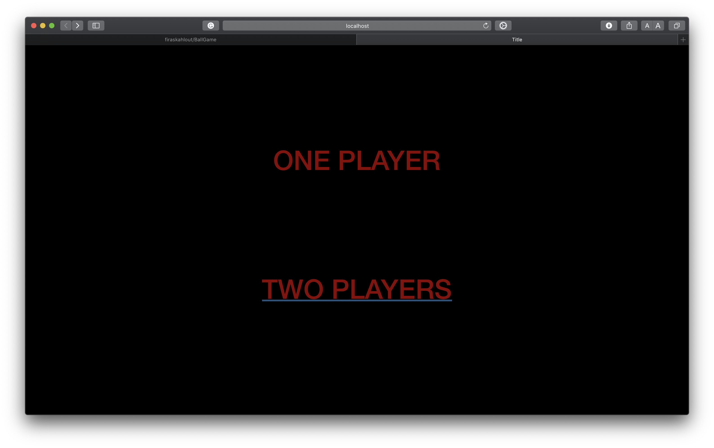
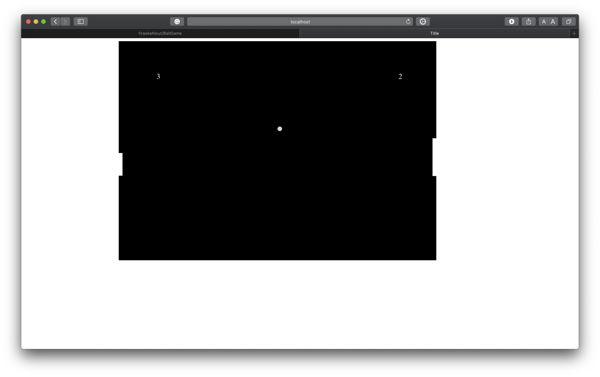
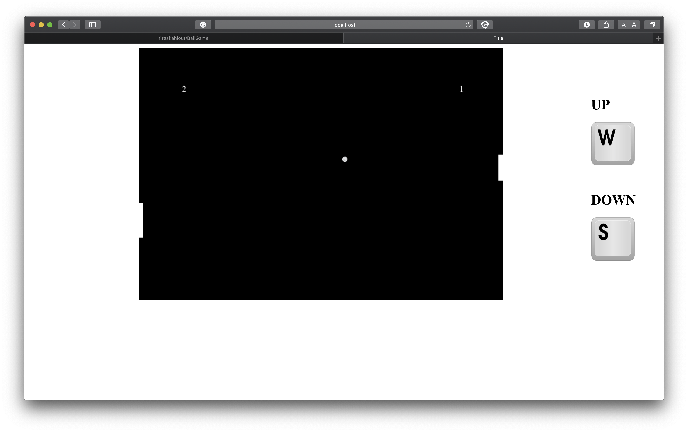
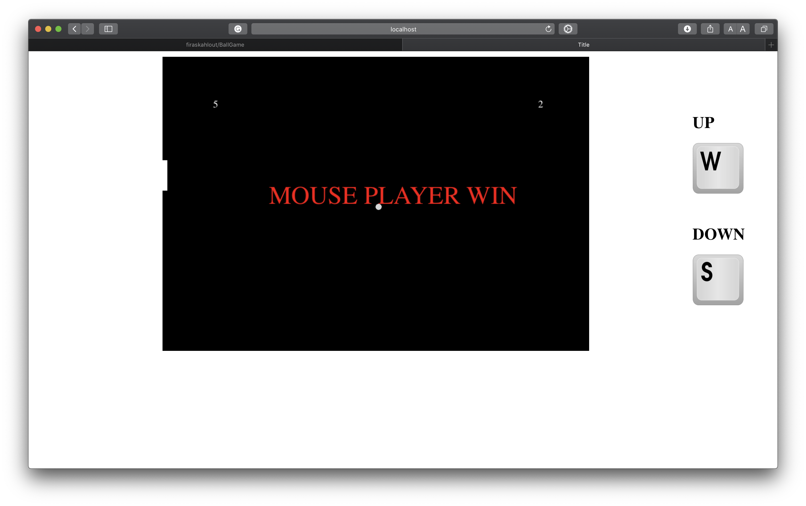

# BallGame   

this game supports one/two players with sounds effects for smashing the ball and one for losing it
* if the user chooses one player he/she will play using the mouse against the auto moving stick 
* if the user chooses two players the first one will play using the mouse and the second one will play using the "W" and "S" keys from the keyboard 
* when the user lost the ball his/her stick will get shorter after 5 ball losses it will disappear and he/she will be the loser and the against one will win
but in one player case, the auto moving stick will not get shorter

## Screenshots 

### Main Page 

### One Player

### Two Players

